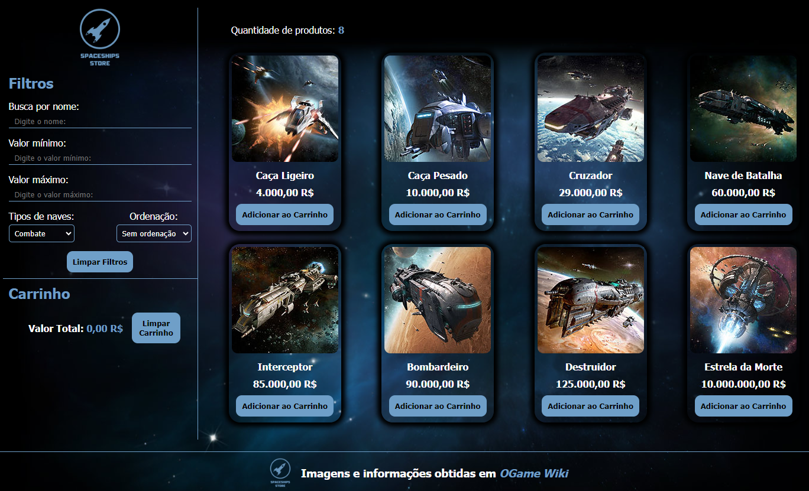
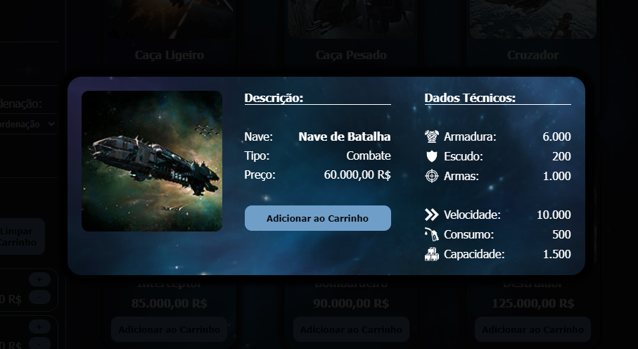
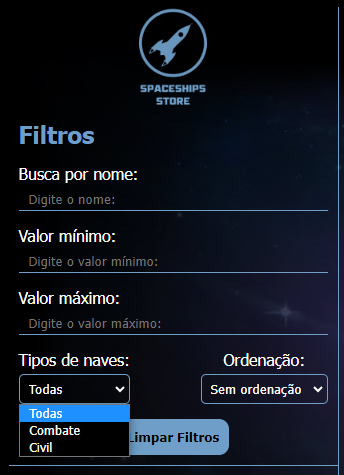
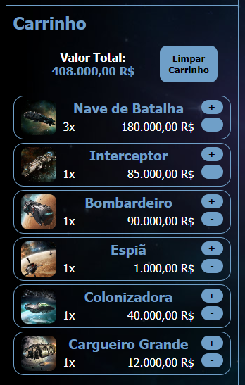

<h1 align="center">Projeto Labecommerce</h1>

<div align="center">


</div>

<p align="center"><strong>Deploy: </strong> <a href="https://wylchayer.github.io/projeto-frontendreact/">https://wylchayer.github.io/projeto-frontendreact/</a> </p>
<br>
<p align="center">
<span><strong>Tecnologias utilizadas:</strong></span>
<br>
  <a href="https://skillicons.dev">
    
  </a>
</p>

## Índice

* [1. Resumo do Projeto](#1-resumo-do-projeto)
* [2. Definição do Projeto](#2-definição-do-projeto)
* [3. Instalações](#3-instalações)
* [4. Iniciando](#4-iniciando)
* [5. Tecnologias utilizadas](#5-tecnologias-utilizadas)
* [6. Lista de Requisitos do Projeto](#6-lista-de-requisitos-do-projeto)
* [7. Desenvolvedor](#6-desenvolvedor)

***
## 1. Resumo do Projeto

O **LabeCommerce** foi o segundo projeto desenvolvido totalmente do zero no *bootcamp da Labenu*. O principal objetivo era desenvolver um ecommerce em react utilizando os seguintes conteúdos:
 - componentes;
 - fluxo de dados;
 - hooks (useState e useEffect);
 - renderização de listas;
 - localStorage;
 - filtros, ordenação e busca;
 - renderização condicional (utilizado como Modal).

Com esses conteúdos foi desenvolvido o [**SpaceShips Store**](https://wylchayer.github.io/projeto-frontendreact/).

***
## 2. Definição do Projeto
O [**SpaceShips Store**](https://wylchayer.github.io/projeto-frontendreact/) é uma loja de naves espaciais desenvolvida com as naves do jogo de browser [_OGame_](https://br.ogame.gameforge.com/landing/), da Gameforge. 

<p align="center"></p>

A página inicial apresenta ao usuários todas as naves disponíveis no game, mostrando o nome e valor. Ao clicar no cartão da nave é apresentado, através de Modal, todos os dados técnicos e o tipo dela. 

<p align="center"></p>

Adicionalmente o usuário tem a possibilidade de filtrar as naves pelo nome (ou parte dele), valor mínimo, valor máximo e tipos (combate ou civil), além de ordenar por preço (crescente e decrescente).

<p align="center"></p>

O usuário também pode adicionar as naves ao carrinho ao clicar no botão **"Adicionar ao Carrinho"** de cada nave, além de manipular a quantidade clicando novamente nesse botão ou nos botões **"+"** e **"-"** localizados no carrinho. Todos os itens do carrinho são salvos no localStorage e resgatados de lá, de forma que o usuário não perderá naves adicionadas ao carrinho caso a página seja atualizada.

<p align="center"></p>

Para facilitar a navegação, a página contém o botão **"Limpar Filtros"** para limpar todos os filtros e também o botão **"Limpar Carrinho"** para zerar o carrinho.

***
## 3. Instalações

### Pré-requisitos:
* node.js
* npm

***

## 4. Iniciando

* Para instalar as dependências no diretório do seu projeto execute:
```
npm install
```

* Para iniciar o aplicativo execute:
```
npm run dev
```

***

## 5. Tecnologias utilizadas
Esse programa foi construído com:
* JavaScript
* React
* Styled-Components

***

## 6. Lista de Requisitos do Projeto

- Lista de Produtos
    - ✅  O usuário deve ser capaz de visualizar uma lista de produtos
    - ✅  O usuário deve ser capaz de visualizar os dados do produto (nome, preço e imagem)
    - ✅  O usuário deve ser capaz de adicionar um produto no carrinho
- Carrinho
    - ✅  O usuário deve ser capaz de visualizar os produtos adicionados
    - ✅  O usuário deve ser capaz de visualizar a quantidade correta de cada produto
    - ✅  O usuário deve ser capaz de remover itens do carrinho
    - ✅  O usuário deve ser capaz de ver corretamente o valor total de sua compra
    - ✅  Quando a página é atualizada, os itens devem continuar no carrinho
- Filtros e Ordenação
    - ✅  O usuário deve ser capaz de filtrar os itens por preço mínimo
    - ✅  O usuário deve ser capaz de filtrar os itens por preço máximo
    - ✅  O usuário deve ser capaz de realizar uma busca por nome
    - ✅  O usuário deve ser capaz de ordenar os itens em ordem crescente ou decrescente
    - ✅  O usuário deve ser capaz de adicionar  filtros, busca e ordenação simultaneamente
    - ✅  O usuário deve ser capaz de retornar à visualização sem filtros


***

## 7. Desenvolvedor
 Este projeto foi desenvolvido por:
* **Wylchayer Cruz** : [Linkedin](https://www.linkedin.com/in/wylchayer-cruz/) | [GitHub](https://github.com/wylchayer)

